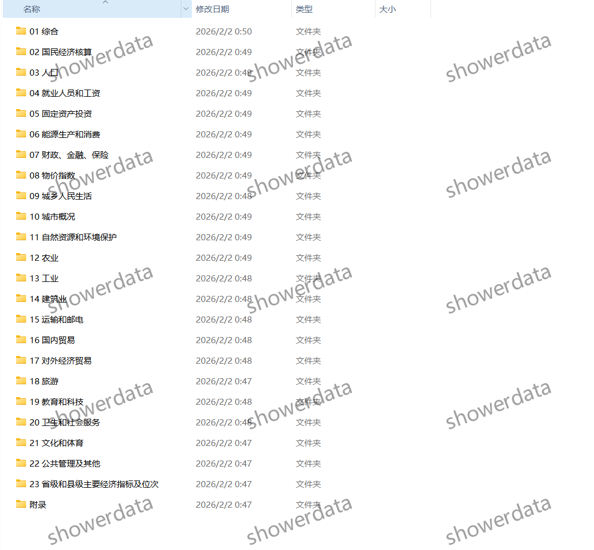
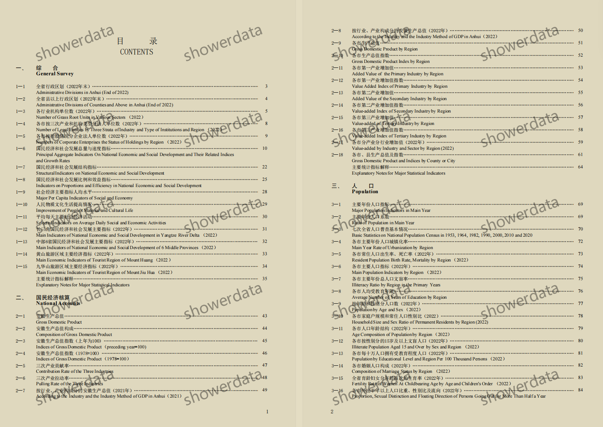
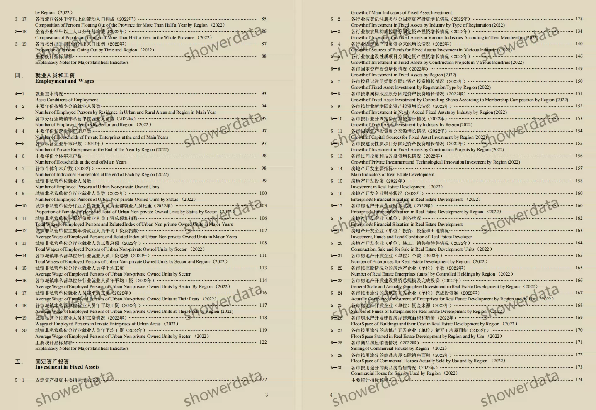
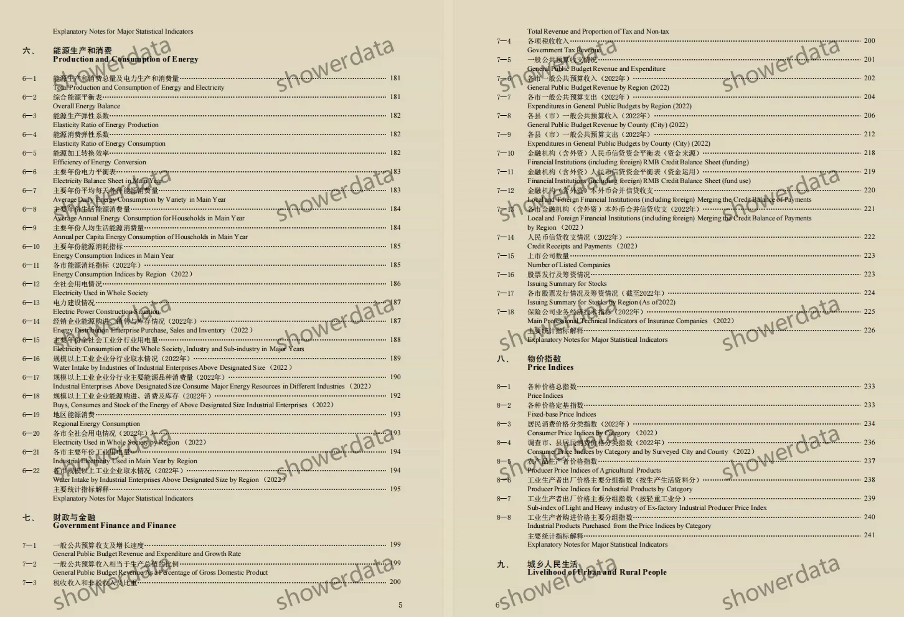
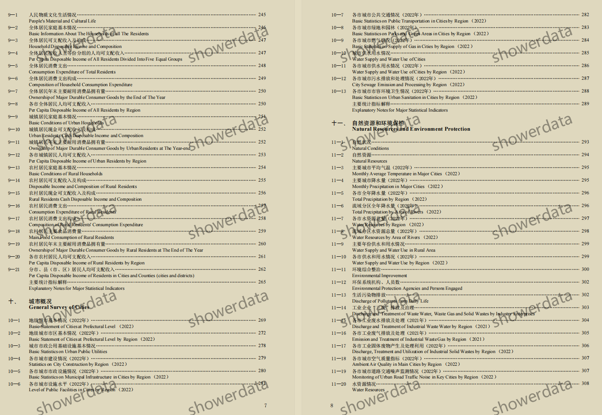
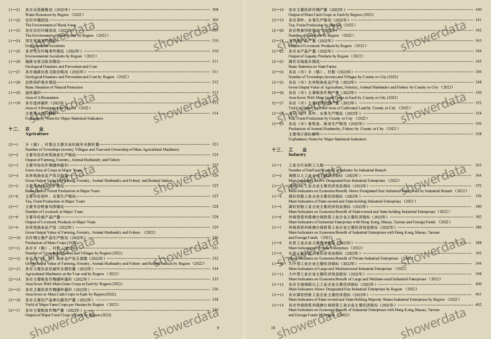
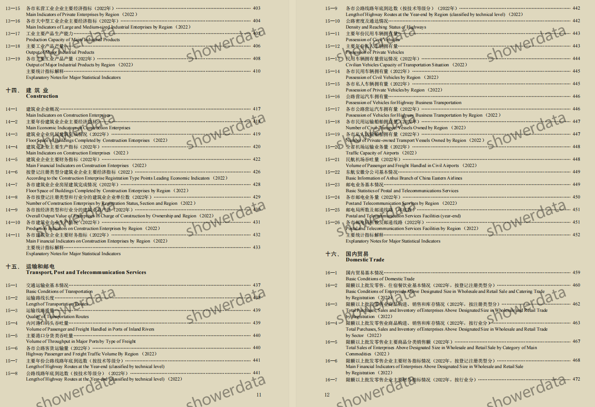
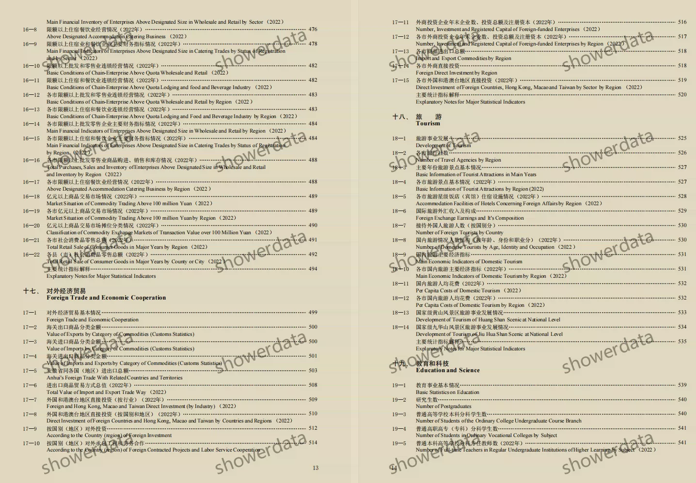

## Body

《安徽统计年鉴》（1989-2025年）数据年份：标题年份为资料编写年份，数据年份为年鉴出版年份前一年。
注意事项见下方描述及图片，拍前请看清楚！已完整展示说明，请确定好是不是自己需要的再拍下！发货后任何理由不退不换！ 

01、数据简介
《安徽统计年鉴》（1989-2025年）

02、指标详情
（1）目录已在图片展示，篇幅有限只能展示部分，仅供参考，具体年鉴内容以实际为准，请自助查看，酌情购买，指标众多不帮忙找数据，都在这里，发货后不支持无理由退货，介意勿拍。
（2）展示目录excel格式为2025年，2023年为pdf，篇幅有限只展示部分，不同年份统计口径可能会变动，学术常识，统计资料记载的数据年份是上一年的数据也是学术常识，望周知。
（3）如资料放置于压缩包中，压缩包需先保存，再下载，再解压。

## Images

Here is a pay link on Stripe ( https://buy.stripe.com/3cs8yP7sY87d0vu9AB ). Please contact me lonlonago@foxmail.com after funding $89, and I will send you a complete data files , thank you!

